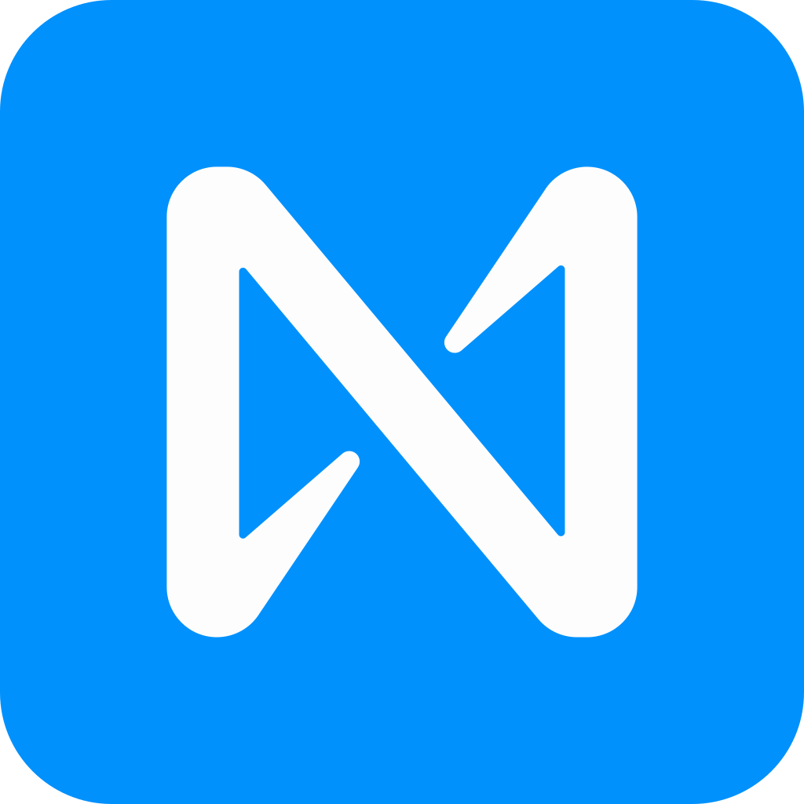
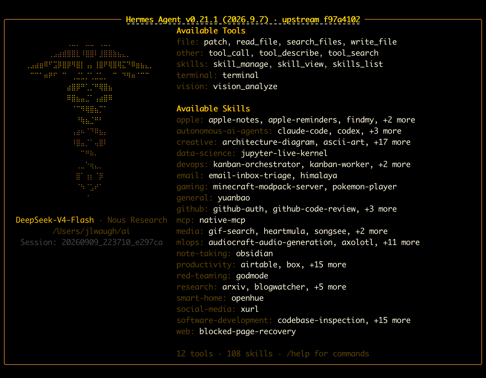
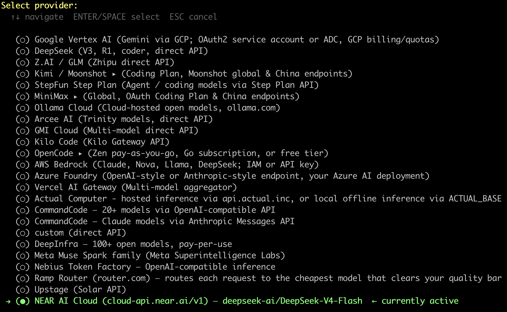

# Setting Up Hermes with NEAR AI Cloud

<p align="center">
  <br/><br/>
  
</p>

Configure [NEAR AI Cloud](https://cloud.near.ai) as the model provider for your
[Hermes Agent](https://hermes-agent.nousresearch.com/docs).

> NEAR AI Cloud has no Hermes plugin, so you configure it as a custom
> [OpenAI-compatible endpoint](https://docs.near.ai/cloud/guides/openai-compatibility).

**Already have Hermes?** Skip to the [one-liner](#one-liner-point-an-existing-hermes-at-near).
**New to Hermes?** Install it in [section 0.1](#01-install-hermes-agent) or see the
[Installation guide](https://hermes-agent.nousresearch.com/docs/getting-started/installation).

**The short version:**

| Step | Do this |
|------|---------|
| 1. Get a key | [NEAR AI Cloud platform](https://cloud.near.ai/dashboard/organizations) → generate API key |
| 2. Base URL | `https://cloud-api.near.ai/v1` |
| 3. Run setup | `hermes setup model` → pick **Custom endpoint** |
| 4. Add cred | paste key, pick a [gateway model](#model-selection) |

---

## 0. Prerequisites

### 0.1 Install Hermes Agent

**Command-line install (this guide uses the CLI):**

Linux / macOS / WSL2 / Android (Termux):
```bash
curl -fsSL https://hermes-agent.nousresearch.com/install.sh | bash
```

Windows (native) — in PowerShell:
```powershell
iex (irm https://hermes-agent.nousresearch.com/install.ps1)
```

After it finishes, reload your shell:
```bash
source ~/.bashrc   # or source ~/.zshrc
```

For detailed installation options, prerequisites, and troubleshooting, see the
[Installation guide](https://hermes-agent.nousresearch.com/docs/getting-started/installation).

### 0.2 Confirm + what you need next

- Hermes installed and on your PATH (`hermes --version` works)
- A [NEAR AI Cloud](https://cloud.near.ai) account
- Scrollable patience (the wizard is interactive)

Next step: [get a NEAR AI Cloud API key](#get-a-near-ai-cloud-api-key).

## 1. Get a NEAR AI Cloud API key

1. Open the [NEAR AI Cloud Dashboard](https://cloud.near.ai/dashboard/organizations).
2. Generate an API key.
3. Keep the key handy — **you will paste it into the wizard's "Custom endpoint"
   prompt**. Treat it as a secret; never commit it to a repo.

**The endpoint you need** (gateway — routes to any model):

```
https://cloud-api.near.ai/v1
```

## 2. Run the setup wizard

```bash
hermes setup model
```

Two ways to run it:

- **Scoped to the model step** (recommended here) — `hermes setup model` takes
  you straight to the provider/model picker, skipping the rest of the wizard:

  ```
  Custom endpoint
  ```

- **Full setup from a blank slate** — a bare `hermes setup` runs the whole
  wizard (TTS, terminal, tools, etc.). If you're configuring a fresh install,
  this covers everything in one pass; you'll still hit the provider picker and
  choose **Custom endpoint** there.

The wizard then prompts you for:

1. **Base URL** — enter:
   ```
   https://cloud-api.near.ai/v1
   ```
2. **API key** — paste your NEAR AI Cloud key.
3. **Model ID** — a model available on NEAR. Pick from the **live** gateway list:

   ```bash
   curl https://cloud-api.near.ai/v1/models
   ```

   …or browse the visual [model catalog](https://cloud.near.ai/models).

### Model selection

The catalog and `/v1/models` distinguish two kinds of models:

| Kind | Example | Privacy/verifiability |
|------|---------|----------------------|
| **TEE-hosted** | `deepseek-ai/DeepSeek-V4-Flash`, `z-ai/glm-5.2` | NEAR's TEE guarantee applies; direct-completions endpoints available |
| **Third-party (proxied)** | OpenAI, Anthropic/Claude, Gemini, … | Same API & billing, but TEE guarantee does **not** reach the upstream provider |

Pick a **TEE-hosted** model if private/verifiable inference matters; otherwise any
listed model works via the gateway. Model IDs rotate — always pull fresh from
the catalog or `/v1/models` rather than hardcoding.

That's it. Hermes saves the selection to `~/.hermes/config.yaml`.

## 3. Verify it's wired correctly

```bash
hermes status            # shows active provider/model + component health
hermes doctor            # checks config + dependencies for the custom endpoint
hermes chat -q "Hello"   # one-shot smoke test
```

`hermes status` and `hermes doctor` should both show the NEAR endpoint/model as
active and your config healthy. Starting Hermes brings up the agent with its
tools and skills loaded:



## 4. What the config ends up looking like

After setup, `~/.hermes/config.yaml` contains a `model:` block like this
(this is your machine's live config):

```yaml
model:
  default: deepseek-ai/DeepSeek-V4-Flash
  provider: custom
  base_url: https://cloud-api.near.ai/v1
  api_key: ${HERMES_CUSTOM_CLOUD_API_NEAR_AI_API_KEY}
```

- **provider: `custom`** — maps to the generic OpenAI-compatible driver (no
  provider-specific plugin, as noted above).
- **api_key** — the actual key lives in `~/.hermes/.env`; `config.yaml` only
  holds an env-var reference (`${...}`). The exact token name is generated from
  the base URL, so don't expect it to match another host's.

> **Auxiliary models.** Some side tasks (image analysis, title generation,
> compression) reuse your main model by default. Route them to a cheaper model
> via `auxiliary.<task>.model` if you want — see Hermes'
> [auxiliary-model docs](https://hermes-agent.nousresearch.com/docs/user-guide/configuration#auxiliary-models).

## 5. Switch models later (no full wizard needed)

To change just the model without re-running the whole wizard, use the config
command or the interactive picker:

```bash
hermes config set model.default <model-id>
```

Note: the `hermes model` picker is a *model and provider* picker — if your
provider is already `custom`, it'll mainly just change the model (don't
re-pick the provider there).

---

## One-liner: point an existing Hermes at NEAR

If Hermes is already installed and you want to switch to NEAR in one shot (or
reset your model), skip the wizard and set the four model keys directly — this
is the underlying equivalent of what the wizard does:

```bash
# base URL (custom/OpenAI-compatible endpoint)
hermes config set model.base_url https://cloud-api.near.ai/v1

# provider stays 'custom'
hermes config set model.provider custom

# api key (stored in ~/.hermes/.env, referenced by env-var expansion)
hermes config set model.api_key '${YOUR_NEAR_API_KEY_ENV}'

# model
hermes config set model.default <model-id>
```

Then either `export YOUR_NEAR_API_KEY_ENV=<key>` in your shell rc, or add it to
`~/.hermes/.env`. Reload with `hermes` and you're set.

---

## Common issues

- **Connection errors on the chat path** — double-check the base URL is
  `https://cloud-api.near.ai/v1` (no trailing `/chat/completions`).
- **Auth failures** — confirm the key is a NEAR AI Cloud dashboard key and that
  the env var token in `model.api_key` actually resolves (check `~/.hermes/.env`).
- **Model not found** — confirm the model ID exists in the gateway list:
  `curl https://cloud-api.near.ai/v1/models`. The default gateway routes to any
  listed model. Note: `deepseek-ai/DeepSeek-V4-Flash` (your current default) is
  on the list and verified routable.

---

## What a working setup looks like

Your Hermes model/provider picker shows **NEAR AI Cloud** as the selected provider:



That, plus a clean `hermes status` / `hermes chat -q` (section 3), is your
"it works" confirmation.

**References:** NEAR AI Cloud OpenAI compatibility —
https://docs.near.ai/cloud/guides/openai-compatibility.md · Hermes providers —
https://hermes-agent.nousresearch.com/docs/integrations/providers